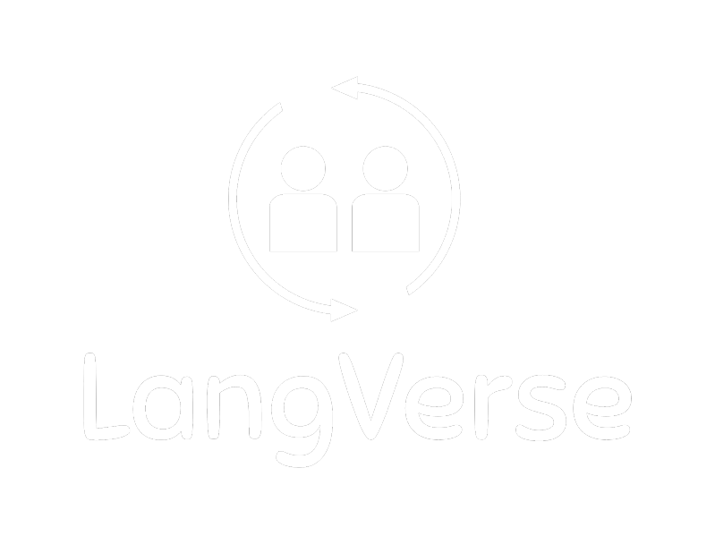
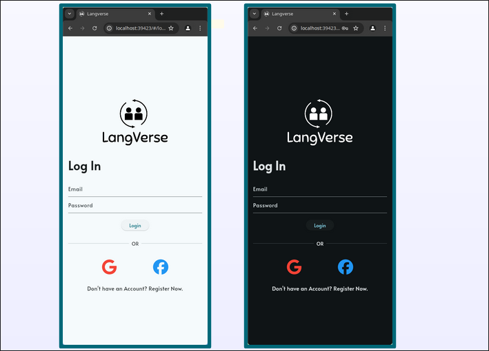
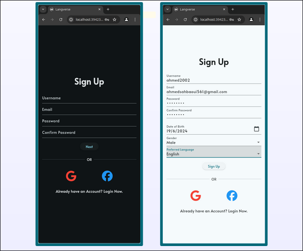
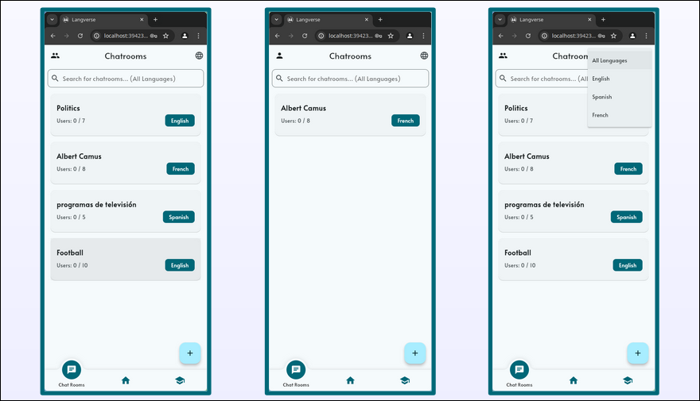
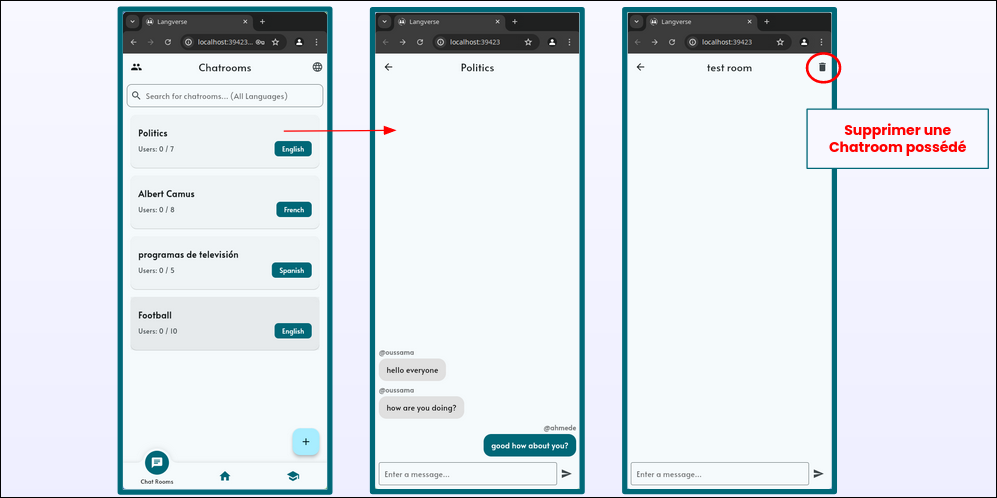
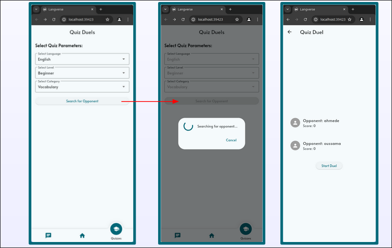

# LangVerse


**LangVerse** is a collaborative Flutter mobile app project designed to facilitate language learning through interactive chatrooms and quiz duels between users.

## Features

### 1. Authentication

Users can securely sign up, log in, and manage their accounts to personalize their experience and track progress across chatrooms and quizzes.




### 2. Chatrooms

Users can either create or join different chatrooms based on the language they are learning. They can also search for chatrooms by name or topic, interact with native speakers, and practice their communication skills in real-time.




### 3. Quiz Duels

Users can challenge each other to quiz duels in various languages. Each duel consists of multiple-choice questions designed to test vocabulary, grammar, and comprehension.



### 4. Customizable Light/Dark Theme

Users can personalize their experience by switching between light and dark themes, with full control over the app's appearance.

## Project Structure

The project follows a typical Flutter structure, with the codebase split into modules organized in different folders based on their purpose:
```
lib/
├── models/           # Firebase data models for chatrooms, quizzes, etc.
├── pages/            # All UI pages like login_page, quiz_duel_page, etc.
├── services/         # All things related to state/database handling
├── preferences/      # User preferences and settings management
└── widgets/         # Custom Shared widgets for UI components
```

## Installation

To run the LangVerse app on your local machine, follow these steps:

1. **Clone the repository**:
   ```bash
   git clone https://github.com/oussama12DEV/LangVerse
   ```
2. **Navigate to the project directory**:
   ```bash
   cd Langerse
   ```
3. **Install dependencies**:
   ```bash
   flutter pub get
   ```
4. **Run the app**:
   ```bash
   flutter run
   ```

## License

This project is licensed under the MIT License – see the [LICENSE](LICENSE) file for details.